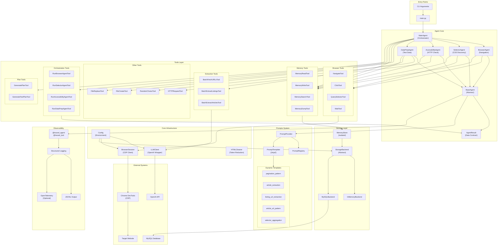
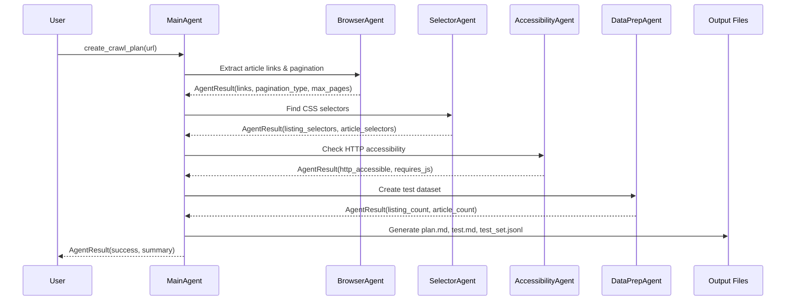

# Crawler Agent Architecture

Component-level architecture diagram showing the multi-agent web crawler system.

## System Overview



## Component Descriptions

| Component | Purpose |
|-----------|---------|
| **MainAgent** | Orchestrates workflow: site analysis, selector discovery, accessibility check, test data prep |
| **BrowserAgent** | Navigates pages, extracts links, handles pagination using CDP |
| **SelectorAgent** | Discovers and validates CSS selectors for listings and articles |
| **AccessibilityAgent** | Tests if site works without JavaScript via HTTP requests |
| **DataPrepAgent** | Creates test datasets by sampling pages and extracting content |
| **BaseAgent** | Abstract base with tool execution loop and observability |
| **AgentResult** | Typed data contract for inter-agent communication |
| **PromptProvider** | Central access point for all prompts and templates |
| **PromptRegistry** | Versioned storage for static agent prompts |
| **PromptTemplate** | Jinja2-based dynamic prompt rendering |
| **MemoryStore** | Isolated key-value storage per agent |
| **StorageBackend** | Abstract interface for persistence (InMemory/MySQL) |
| **LLMClient** | OpenAI API wrapper with retry logic |
| **BrowserSession** | Chrome DevTools Protocol client for browser automation |
| **Observability** | @traced_agent/@traced_tool decorators for structured logging |

## Data Flow



## Memory Isolation

Each agent operates with an isolated MemoryStore to prevent implicit data sharing:

```
MainAgent (orchestrator memory)
    ├── BrowserAgent (isolated memory)
    ├── SelectorAgent (isolated memory)
    ├── AccessibilityAgent (isolated memory)
    └── DataPrepAgent (isolated memory)
```

Data flows explicitly via:
1. **AgentResult.data** - Structured return values
2. **Context parameters** - Passed when running sub-agents
3. **Orchestrator memory** - Optional shared storage via `store_keys`
