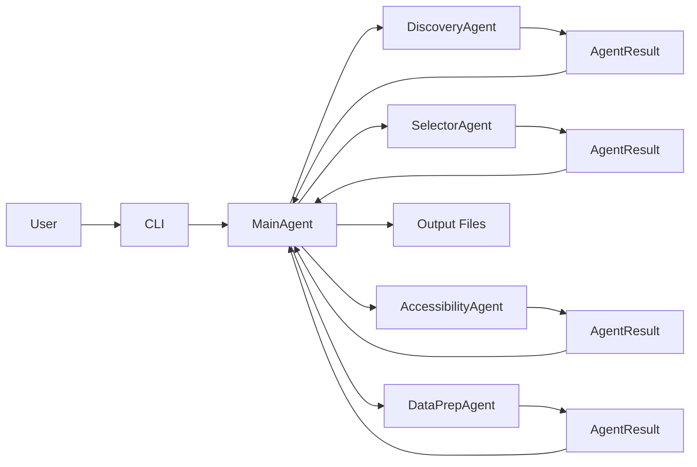
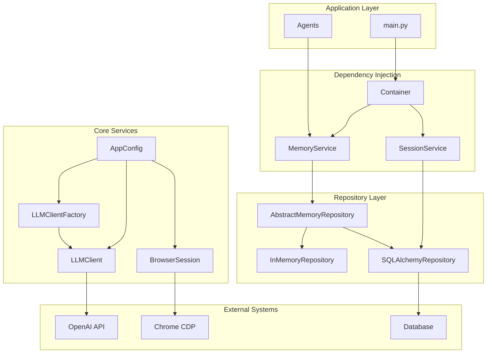
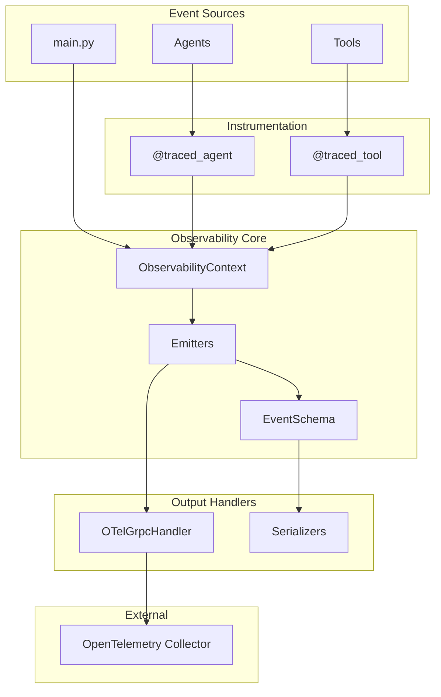

# Crawler Agent Architecture

Component-level architecture diagrams for the multi-agent web crawler system.

## Simplified Agent Flow


## Agent System Overview

```mermaid
flowchart TB
    subgraph Entry["Entry Points"]
        main["main.py"]
        cli["CLI Arguments"]
            subgraph Agents["Agent Core"]
        direction TB
        MainAgent["MainAgent<br/>(Orchestrator)"]
        DiscoveryAgent["DiscoveryAgent<br/>(Navigation)"]
        SelectorAgent["SelectorAgent<br/>(CSS Discovery)"]
        AccessAgent["AccessibilityAgent<br/>(HTTP Check)"]
        DataPrepAgent["DataPrepAgent<br/>(Test Data)"]
        BaseAgent["BaseAgent<br/>(Abstract)"]
        AgentResult["AgentResult<br/>(Data Contract)"]
        subgraph Tools["Tools Layer"]
            direction TB
                subgraph MemTools["Memory Tools"]
                    MemRead["MemoryReadTool"]
                    MemWrite["MemoryWriteTool"]
                    MemSearch["MemorySearchTool"]
                    MemList["MemoryListTool"]
                    MemDump["MemoryDumpTool"]
                end
                subgraph BrowserTools["Browser Tools"]
                    Navigate["NavigateTool"]
                    GetHTML["GetHTMLTool"]
                    Click["ClickTool"]
                    Query["QuerySelectorTool"]
                    Wait["WaitTool"]
                    ExtractLinks["ExtractLinksTool"]
                end
                subgraph ExtractTools["Extraction Tools"]
                    FetchStore["FetchAndStoreHTMLTool"]
                    BatchFetch["BatchFetchURLsTool"]
                    BatchArticles["BatchExtractArticlesTool"]
                    BatchListings["BatchExtractListingsTool"]
                    RunExtraction["RunExtractionAgentTool"]
                    RunListingExtraction["RunListingExtractionAgentTool"]
                end
                subgraph SelectorTools["Selector Tools"]
                    FindSelector["FindSelectorTool"]
                    TestSelector["TestSelectorTool"]
                    VerifySelector["VerifySelectorTool"]
                    CompareSelectors["CompareSelectorsTool"]
                end
                subgraph SelectorExtractTools["Selector Extraction"]
                    ListingExtractor["ListingPageExtractorTool"]
                    ArticleExtractor["ArticlePageExtractorTool"]
                    SelectorAggregator["SelectorAggregatorTool"]
                end
                subgraph SelectorSamplingTools["Selector Sampling"]
                    ListingPagesGen["ListingPagesGeneratorTool"]
                    ArticlePagesGen["ArticlePagesGeneratorTool"]
                end
                subgraph FileTools["File Tools"]
                    FileCreate["FileCreateTool"]
                    FileRead["FileReadTool"]
                    FileAppend["FileAppendTool"]
                    FileReplace["FileReplaceTool"]
                end
                subgraph OrchTools["Orchestration Tools"]
                    RunDiscovery["RunDiscoveryAgentTool"]
                    RunSelector["RunSelectorAgentTool"]
                    RunAccess["RunAccessibilityAgentTool"]
                    RunDataPrep["RunDataPrepAgentTool"]
                end
                subgraph PlanTools["Plan Tools"]
                    GenPlan["GeneratePlanTool"]
                    GenTest["GenerateTestPlanTool"]
                end
                subgraph AgentToolsGroup["Agent Tools"]
                    AgentTool["AgentTool"]
                    ValidateResponse["ValidateResponseTool"]
                    PrepareValidation["PrepareAgentOutputValidationTool"]
                    GenerateUuid["GenerateUuidTool"]
                    DescribeOutput["DescribeOutputContractTool"]
                    DescribeInput["DescribeInputContractTool"]
                end
                subgraph OtherTools["Other Tools"]
                    RandomChoice["RandomChoiceTool"]
                    HTTP["HTTPRequestTool"]
                end
            end
            subgraph Contracts["Contracts System"]
                direction TB
                ValidationRegistry["ValidationRegistry"]
                SchemaParser["SchemaParser"]
                subgraph Schemas["JSON Schemas"]
                    MainSchema["main_agent/*"]
                    DiscoverySchema["discovery_agent/*"]
                    SelectorSchema["selector_agent/*"]
                    AccessSchema["accessibility_agent/*"]
                    DataPrepSchema["data_prep_agent/*"]
                end
            end
            subgraph Prompts["Prompts System"]
                direction TB
                Provider["PromptProvider"]
                Registry["PromptRegistry"]
                Template["PromptTemplate<br/>(Jinja2)"]
                TemplateRenderer["TemplateRenderer"]
                subgraph PromptTemplates["Templates"]
                    AgentTemplates["agents/*.md.j2"]
                    SharedTemplates["shared/*.md.j2"]
                    DynamicTemplates["dynamic.py"]
                    ExtractionTemplates["extraction.py"]
                    SelectorTemplates["selectors.py"]
                end
            end
        end
    end

    %% Entry flow
    cli --> main
    main --> MainAgent

    %% Agent hierarchy
    MainAgent --> DiscoveryAgent
    MainAgent --> SelectorAgent
    MainAgent --> AccessAgent
    MainAgent --> DataPrepAgent
    DiscoveryAgent --> BaseAgent
    SelectorAgent --> BaseAgent
    AccessAgent --> BaseAgent
    DataPrepAgent --> BaseAgent
    BaseAgent --> AgentResult

    %% Contracts flow
    BaseAgent --> ValidationRegistry
    ValidationRegistry --> SchemaParser
    SchemaParser --> Schemas
    AgentToolsGroup --> ValidationRegistry

    %% Agent to Tools
    MainAgent --> MemTools
    MainAgent --> OrchTools
    MainAgent --> PlanTools
    MainAgent --> FileTools
    MainAgent --> AgentToolsGroup
    DiscoveryAgent --> BrowserTools
    DiscoveryAgent --> MemTools
    SelectorAgent --> SelectorTools
    SelectorAgent --> SelectorExtractTools
    SelectorAgent --> SelectorSamplingTools
    SelectorAgent --> BrowserTools
    SelectorAgent --> MemTools
    AccessAgent --> HTTP
    AccessAgent --> MemTools
    DataPrepAgent --> ExtractTools
    DataPrepAgent --> RandomChoice
    DataPrepAgent --> MemTools

    %% Prompts flow
    BaseAgent --> Provider
    Provider --> Registry
    Provider --> Template
    Template --> TemplateRenderer
    TemplateRenderer --> PromptTemplates
```




## Infrastructure



## Observability



## Data Flow


## Component Descriptions

| Component | Purpose |
|-----------|---------|
| **MainAgent** | Orchestrates workflow: site analysis, selector discovery, accessibility check, test data prep |
| **DiscoveryAgent** | Navigates pages, extracts links, handles pagination using CDP |
| **SelectorAgent** | Discovers and validates CSS selectors for listings and articles |
| **AccessibilityAgent** | Tests if site works without JavaScript via HTTP requests |
| **DataPrepAgent** | Creates test datasets by sampling pages and extracting content |
| **BaseAgent** | Abstract base with tool execution loop and observability |
| **AgentResult** | Typed data contract for inter-agent communication |
| **Container** | Dependency injection for services and repositories |
| **MemoryService** | Isolated key-value storage per agent with session context |
| **SessionService** | Tracks crawler sessions with status and timing |
| **ValidationRegistry** | Manages JSON Schema validation for agent contracts |
| **LLMClient** | OpenAI API wrapper with retry logic |
| **LLMClientFactory** | Multi-model support with per-component model assignments |
| **BrowserSession** | Chrome DevTools Protocol client for browser automation |

## Memory Isolation

Each agent operates with an isolated MemoryService to prevent implicit data sharing:

```
Container (DI root)
└── MemoryService instances (per agent)
    ├── MainAgent (orchestrator memory)
    ├── DiscoveryAgent (isolated memory)
    ├── SelectorAgent (isolated memory)
    ├── AccessibilityAgent (isolated memory)
    └── DataPrepAgent (isolated memory)
```

Data flows explicitly via:
1. **AgentResult.data** - Structured return values
2. **Context parameters** - Passed when running sub-agents
3. **Orchestrator memory** - Optional shared storage via `store_keys`

## Contract Validation

Each agent has input/output JSON schemas for validation:

```
src/contracts/schemas/
├── main_agent/
│   ├── input.schema.json
│   └── output.schema.json
├── discovery_agent/
│   ├── input.schema.json
│   └── output.schema.json
├── selector_agent/
│   ├── input.schema.json
│   └── output.schema.json
├── accessibility_agent/
│   ├── input.schema.json
│   └── output.schema.json
└── data_prep_agent/
    ├── input.schema.json
    └── output.schema.json
```

## Multi-Model Support

```
LLMClientFactory
├── ComponentModelConfig (env-based)
├── ModelRegistry (available models)
└── Per-component clients
    ├── main_agent → gpt-4o
    ├── discovery_agent → gpt-4o-mini
    ├── selector_agent → gpt-4o
    └── batch_extract_* → gpt-4o-mini
```
