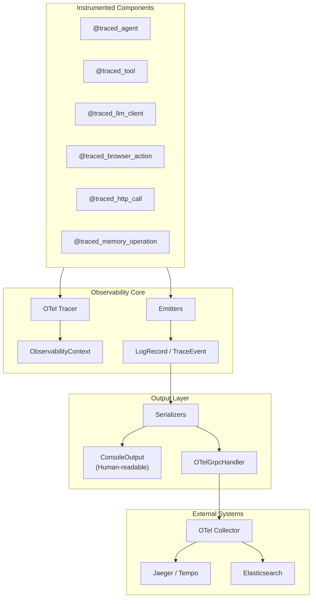

# Observability

Enterprise-grade observability for the Crawler Agent system with OpenTelemetry-native distributed tracing and structured logging.

## Overview

The observability module provides:

- **Decorator-based instrumentation** — Zero-code-change tracing with `@traced_agent`, `@traced_tool`
- **Automatic context propagation** — OTel-native span hierarchy with trace/span ID correlation
- **Structured logging** — JSON-formatted logs with Elasticsearch-ready schema
- **Multi-backend support** — Console output for dev, OTel Collector for production

## Architecture



## Quick Start

```python
from src.observability import (
    ObservabilityConfig,
    initialize_observability,
    shutdown,
)
from src.observability.handlers import OTelGrpcHandler, OTelConfig
from src.observability.decorators import traced_tool, traced_agent

# Initialize at application start
handler = OTelGrpcHandler(OTelConfig(
    endpoint="localhost:4317",
    insecure=True,
    service_name="crawler-agent",
))
initialize_observability(handler=handler)

# Instrument your components
@traced_tool(name="MyTool")
def my_tool(arg: str) -> dict:
    return {"result": arg}

@traced_agent(name="MyAgent")
async def run_agent(task: str) -> dict:
    result = my_tool("hello")
    return {"success": True}

# Shutdown gracefully
shutdown()
```

## Decorators

| Decorator | Use Case |
|-----------|----------|
| `@traced_agent` | Agent classes and methods |
| `@traced_tool` | Tool execute methods |
| `@traced_llm_client` | LLM API calls |
| `@traced_browser_action` | Browser/CDP operations |
| `@traced_http_call` | HTTP requests |
| `@traced_memory_operation` | Memory read/write |

All decorators:
- Create OTel spans with proper parent-child hierarchy
- Capture timing metrics (duration_ms)
- Log start/end/error events
- Propagate context automatically

## Emitters

Manual event emission for custom logging:

```python
from src.observability.emitters import emit_info, emit_warning, emit_error
from src.observability.context import get_or_create_context

ctx = get_or_create_context("my_component")

emit_info(
    event="operation.started",
    ctx=ctx,
    data={"url": "https://example.com"},
    tags=["crawl", "navigation"]
)

emit_warning(
    event="rate_limit.approaching",
    ctx=ctx,
    data={"remaining": 10}
)

emit_error(
    event="operation.failed",
    ctx=ctx,
    data={"error": "Connection timeout"}
)
```

## Schema

Log records follow a structured schema optimized for Elasticsearch:

| Field | Type | Description |
|-------|------|-------------|
| `timestamp` | date | ISO 8601 timestamp |
| `trace_id` | keyword | OTel trace ID |
| `span_id` | keyword | OTel span ID |
| `parent_span_id` | keyword | Parent span ID |
| `session_id` | keyword | Crawler session ID |
| `level` | keyword | Log level (metadata only) |
| `event` | keyword | Event name |
| `component_type` | keyword | agent/tool/llm_client |
| `component_name` | keyword | Component name |
| `data` | object | Event payload |
| `metrics` | object | Timing/count metrics |
| `tags` | keyword[] | Event tags |

## Configuration

Environment variables:

| Variable | Default | Description |
|----------|---------|-------------|
| `OTEL_ENDPOINT` | localhost:4317 | OTel Collector gRPC endpoint |
| `OTEL_INSECURE` | true | Use insecure connection |
| `SERVICE_NAME` | crawler-agent | Service name for traces |
| `LOG_CONSOLE` | true | Enable console output |
| `LOG_COLOR` | true | Colorized console output |

## Data Flow

```
Spans:  decorators → OTel tracer → OTel Collector → Jaeger/Tempo
Logs:   emitters → handler.send_log() → OTel Collector → Elasticsearch
```

## Key Concepts

1. **Level is metadata only** — Never used for filtering, all logs are always emitted
2. **Spans from decorators** — Proper parent-child hierarchy via OTel context
3. **Automatic correlation** — Logs get trace_id/span_id from active OTel span
4. **Component types** — AGENT, TOOL, LLM_CLIENT for categorization

## Module Structure

```
src/observability/
├── __init__.py       # Public API exports
├── config.py         # ObservabilityConfig, initialization
├── context.py        # ObservabilityContext, span management
├── decorators.py     # @traced_* decorators
├── emitters.py       # emit_info/warning/error functions
├── handlers.py       # OTelGrpcHandler, LogHandler interface
├── outputs.py        # ConsoleOutput, LogOutput
├── schema.py         # LogRecord, TraceEvent, field definitions
├── serializers.py    # JSON serialization, error extraction
└── tracer.py         # OTel tracer management
```
